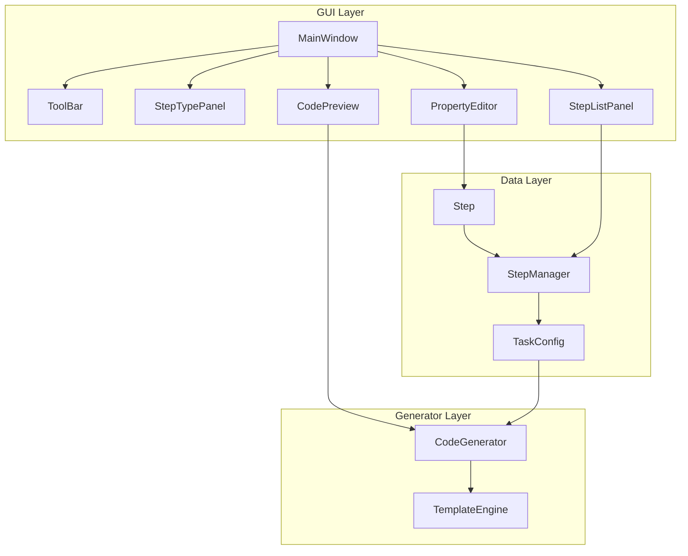

# 自动化任务生成器 GUI 实施计划

## 项目概述

创建一个基于 CustomTkinter 的可视化自动化任务配置工具，复用现有 [`auto_signin.py`](../auto_signin.py) 中的核心类（ImageFinder、HumanMouse、WxPush），用户可以通过点击方式配置自动化步骤，并生成可执行的 Python 代码。

## 架构设计



## 文件结构

```
新建文件夹/
├── auto_task_gui.py          # 主 GUI 程序 [新建]
├── task_templates/           # 代码模板目录 [新建]
│   └── base_template.py      # 基础模板
├── tasks/                    # 保存的任务配置 [新建]
│   └── example.json          # 示例配置
├── auto_signin.py            # 现有签到脚本 [复用]
├── capture_tool.py           # 现有截图工具 [复用]
└── images/                   # 图片素材
```

## 核心类设计

### 1. Step 数据类

```python
@dataclass
class Step:
    id: str                    # 唯一标识
    step_type: str             # 步骤类型
    params: dict               # 参数字典
    enabled: bool = True       # 是否启用
```

### 2. StepManager 步骤管理器

```python
class StepManager:
    steps: List[Step]
    
    def add_step(step_type: str) -> Step
    def remove_step(step_id: str) -> bool
    def move_step(step_id: str, direction: int) -> bool
    def update_step(step_id: str, params: dict) -> bool
    def get_step(step_id: str) -> Step
```

### 3. TaskConfig 任务配置

```python
class TaskConfig:
    name: str
    description: str
    steps: List[Step]
    settings: dict
    
    def save(filepath: str) -> bool
    def load(filepath: str) -> TaskConfig
    def to_dict() -> dict
```

### 4. CodeGenerator 代码生成器

```python
class CodeGenerator:
    def generate_step_code(step: Step) -> str
    def generate_full_code(config: TaskConfig) -> str
    def get_imports() -> str
```

## 步骤类型定义

| 类型 | 图标 | 参数 | 生成代码示例 |
|------|------|------|-------------|
| click_image | 📌 | image_path, confidence, timeout | `finder.wait_for_image(...); mouse.click(...)` |
| wait_image | ⏳ | image_path, confidence, timeout | `finder.wait_for_image(...)` |
| input_text | ⌨️ | text, clear_first | `pyautogui.write(...)` |
| wait_time | ⏱️ | seconds | `time.sleep(...)` |
| open_url | 🌐 | url | `webbrowser.open(...)` |
| clipboard_get | 📋 | var_name | `var = pyperclip.paste()` |
| clipboard_set | 📋 | content | `pyperclip.copy(...)` |
| ocr_region | 🔤 | x, y, width, height, var_name | `ocr_screen_region(...)` |
| press_key | ⌨️ | key, modifiers | `pyautogui.hotkey(...)` |
| condition | ❓ | expression, true_steps, false_steps | `if ...: ...` |
| loop | 🔄 | count/condition, sub_steps | `for i in range(...): ...` |
| wx_push | 📱 | title, content, token | `WxPush.send(...)` |

## GUI 布局设计

```
┌─────────────────────────────────────────────────────────────────────┐
│  [新建] [打开] [保存] [运行] [生成代码]              工具栏           │
├──────────────────┬──────────────────────────────────────────────────┤
│                  │                                                  │
│   步骤类型面板    │              步骤列表区域                         │
│   ─────────────  │   ┌────────────────────────────────────────┐    │
│   📌 点击图片     │   │ ☑ 1. [打开URL] https://example.com     │    │
│   ⏳ 等待图片     │   │ ☑ 2. [等待] 3秒                        │    │
│   ⌨️ 输入文本     │   │ ☑ 3. [点击图片] login_btn.png          │    │
│   ⏱️ 等待时间     │   │ ☐ 4. [输入文本] username               │    │
│   🌐 打开URL     │   │    [↑] [↓] [删除]                      │    │
│   📋 剪贴板操作   │   └────────────────────────────────────────┘    │
│   🔤 OCR识别     │                                                  │
│   ⌨️ 按键操作     │              步骤属性编辑区                       │
│   ❓ 条件判断     │   ┌────────────────────────────────────────┐    │
│   🔄 循环        │   │ 图片路径: [________________] [浏览]     │    │
│   📱 微信推送     │   │ 置信度:   [0.8_____________]           │    │
│                  │   │ 超时:     [30______________] 秒        │    │
│                  │   └────────────────────────────────────────┘    │
├──────────────────┴──────────────────────────────────────────────────┤
│                        代码预览区域                                  │
│  ┌────────────────────────────────────────────────────────────────┐ │
│  │ # 自动生成的代码                                                │ │
│  │ import time, webbrowser                                        │ │
│  │ def step1_open_url():                                          │ │
│  │     webbrowser.open('https://example.com')                     │ │
│  └────────────────────────────────────────────────────────────────┘ │
└─────────────────────────────────────────────────────────────────────┘
```

## JSON 配置格式

```json
{
  "name": "示例任务",
  "description": "自动签到流程",
  "version": "1.0",
  "settings": {
    "default_confidence": 0.8,
    "default_timeout": 30
  },
  "steps": [
    {
      "id": "step_001",
      "type": "open_url",
      "enabled": true,
      "params": {
        "url": "https://example.com"
      }
    },
    {
      "id": "step_002",
      "type": "wait_time",
      "enabled": true,
      "params": {
        "seconds": 3
      }
    }
  ]
}
```

## 实施步骤

### 阶段 1: 基础框架
1. 创建目录结构 `task_templates/` 和 `tasks/`
2. 创建数据模型 (`Step`, `StepManager`, `TaskConfig`)
3. 创建主窗口框架和基本布局

### 阶段 2: GUI 组件
4. 实现步骤类型面板（左侧可点击按钮列表）
5. 实现步骤列表区域（可选择、排序的列表）
6. 实现步骤属性编辑区（动态表单）
7. 实现代码预览区域（只读文本框）

### 阶段 3: 功能实现
8. 实现工具栏功能（新建/打开/保存/运行/生成代码）
9. 创建代码生成器和模板引擎
10. 实现配置的保存和加载

### 阶段 4: 完善
11. 添加图片浏览器对话框
12. 添加错误处理和验证
13. 测试和调试

## 依赖项

```bash
pip install customtkinter
# 现有依赖（已安装）
pip install pyautogui pillow opencv-python pyperclip requests easyocr
```

## 与现有代码的集成

- 复用 [`auto_signin.py`](../auto_signin.py) 中的 `ImageFinder` 类进行图片匹配
- 复用 `HumanMouse` 类进行鼠标操作
- 复用 `WxPush` 类进行微信推送
- 复用 OCR 相关函数

生成的代码将导入这些现有类，确保代码复用和一致性。
